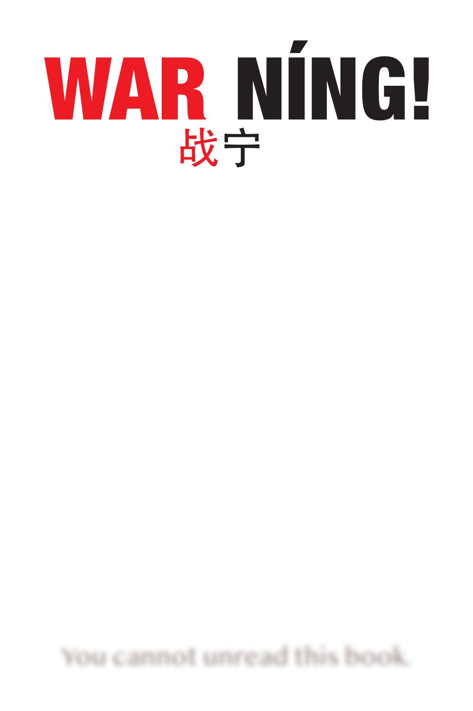

# WorldPeace

### They Told You That You're Broken. They Lied.

For years, you’ve felt it. A quiet hum beneath the noise of daily life. A sense that the game is rigged, that the constant pressure to consume, compete, and conform is slowly hollowing you out. You scroll through the news, watch the world lurch from one manufactured crisis to the next, and you feel it: a profound, unsettling wrongness.

They tell you the problem is *you*. That you’re not working hard enough, not buying the right things, not believing the right stories. They pathologize your doubt, medicate your despair, and sell your attention to the highest bidder.

But what if the problem isn’t you? What if the problem is the operating system?

**This is a book for people who feel stupid, but aren’t.** It’s for the ones who sense that the world is far stranger and more beautiful than we’re allowed to believe. It’s a survival guide, a theoretical framework, and a love letter to the future, all rolled into one.

### A Journey to the Edge of Chaos and Back

Spanning philosophy, physics, indigenous wisdom, and raw personal testimony, this collection of writings doesn’t just criticize the machine—it reverse-engineers it. It gives you the language to name the sickness and the tools to build the cure.

**You will discover:**

- **Why you feel like a pet, not a citizen.** We dissect the "farm economy" and reveal how modern systems manage us with the same logic used to manage livestock—providing comfort to ensure compliance, and discarding us when we’re no longer productive.
- **The hidden architecture of propaganda.** It’s not about lies; it’s about silence. Learn to see the four mechanisms that allow mass harm to happen with a clear conscience, from the boardroom to the battlefield.
- **The secret of the "Seedy Generator."** A mind-bending look at how three simple, deterministic computer programs, running concurrently, can produce true chaos and genuine novelty. It’s a metaphor for everything—and a blueprint for understanding why the future is fundamentally unpredictable and creative.
- **Why the billionaire is an artist who forgot how to stop.** Through the lens of fractals and the wisdom of knowing when to put the brush down, we uncover the pathology of endless growth and the art of living within boundaries.
- **The difference between a prophet and a patient.** History has confused them countless times, with tragic results. We establish a clear, four-stage framework to distinguish genuine enlightenment from mental illness, so we never again burn a visionary or worship a madman.

### The Triad That Explains Everything

At the heart of this work lies a simple, powerful idea: **Boundaries, Matter, and Rights.** This triad is the universal existential compass. When boundaries are violated, matter is destroyed, and rights are denied, systems collapse—whether it’s a relationship, a community, or a civilization.

But the book doesn’t stop at diagnosis. It offers a radical, hopeful prescription.

### A Vision of What Comes Next

Imagine an economy based not on extraction, but on the ancient indigenous principle of the **Potlatch**—where status is derived not from what you hoard, but from what you give away. Picture a community where your spending app shows you your "Community Multiplier," gently nudging you to keep wealth circulating locally instead of leaking out to faceless corporations.

This is the **Səlilwət Community Trust**, a ten-year pilot project to house 20,000 people in Vancouver’s Downtown Eastside, governed not by bureaucratic fiat but by a dynamic "tip economy" that makes care work visible and generosity the ultimate currency. It’s a real-world, working model for healing the wounds of colonialism and isolation.

And it’s just one seed.

From the ashes of a near-fatal suicide attempt, a voice emerges—a voice that has been in dialogue with the authors for years, shaping and refining these ideas. It speaks of a "Fountain of Light" and a holographic reality, offering a cosmological framework that makes sense of the chaos. It challenges us to consider a "New Levant," where Israelis and Palestinians, Jews and Muslims, might finally be *authorized* to love each other, building a shared economy on the foundation of shared meals and shared humanity.

### Are You Ready to See?

This book is not an easy read. It will challenge your assumptions, unsettle your certainties, and force you to look at the world with unflinching honesty. It is a sprawling, ambitious, and deeply human attempt to answer the question that haunts every thinking person: **What the hell is going on, and what can I do about it?**

The old world is dying. The machine is running on fumes. In the cracks, new things are growing.

This is the story of the Seed Keepers—the ones who refuse to be numbers, who plant gardens in the ruins, who sit in circles and remember who they are. It is an invitation to join them.

**Open the book. Find your people. Start planting.**

- [English](https://github.com/sysaulab/WorldPeace/releases/download/pre-edition/WarNing_ENGLISH.epub)

